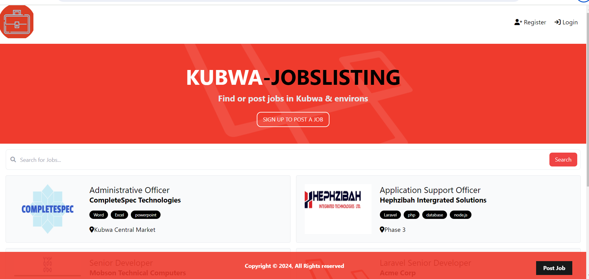

<h1>MY ALX PORTFOLIO PROJECT</h1>
# Kubwa Job Listing Application

---

## Introduction

Welcome to the Kubwa Job Listing Application! This project was born out of my personal experiences and observations within my community. Living in Kubwa City, Abuja, I noticed the challenges faced by job seekers in finding suitable employment opportunities within their locality. With the high cost of transportation to the main city, many individuals struggle to access job listings outside of their immediate area. Recognizing this need, I set out to create a solution that would make job searching more accessible and convenient for Kubwa residents.

**Deployed Site:** [Kubwa Job Listing Application](https://kubwa-joblistings-production.up.railway.app/)

**Final Project Blog Article:** [Read the Blog Article](https://www.linkedin.com/pulse/portfolio-project-blog-post-nkiru-ezefosie-dlu6f)

**Author(s) LinkedIn:**
- [Nkiru Ezefosie](https://www.linkedin.com/in/nkiru-ezefosie-561809117)

---
## Inspiration

The inspiration for the Kubwa Job Listing Application came from my desire to address a real-life problem faced by members of my community. As someone who has experienced the challenges of job hunting firsthand, I understand the importance of having access to localized job listings. By creating this platform, I aimed to empower individuals in Kubwa City to find employment opportunities closer to home, reducing the barriers caused by transportation costs and accessibility.

## Technical Details

### Technologies Used

- Frontend: HTML, CSS, JavaScript
- Backend: Laravel (PHP)
- Database: MySQL
- Deployment: [Railway](https://railway.app/)

### Architecture

The Kubwa Job Listing Application follows a client-server architecture, with the frontend and backend components communicating through RESTful API endpoints. The frontend is designed using HTML, CSS, and JavaScript to provide an intuitive user interface for browsing job listings and applying for positions. The backend is built using the Laravel framework, which handles data processing, authentication, and database interactions. The MySQL database stores job listings, user information, and application records.

### Core Algorithm

One of the key challenges in developing the application was implementing efficient search and filtering algorithms to help users find relevant job listings. I opted for a combination of keyword-based search and category-based filtering to provide users with a personalized job search experience. This involved parsing user input, querying the database for matching listings, and presenting the results in a clear and organized manner.

## Challenges Faced

Throughout the development process, I encountered several challenges, including:

- Learning curve associated with Laravel framework
- Optimizing database queries for performance
- Ensuring cross-browser compatibility for frontend components

## Future Iterations

In future iterations of the Kubwa Job Listing Application, I plan to:

- Expand the scope of the application to include additional features such as job application tracking and employer profiles
- Implement machine learning algorithms for personalized job recommendations
- Enhance the user experience with interactive features and real-time updates

## Installation

To run the Kubwa Job Listing Application locally on your machine, follow these steps:

1. Clone the repository to your local machine using the following command:
   - git clone https://github.com/your-username/kubwa-job-listing.git
2. Navigate to the project directory:
   cd kubwa-job-listing
3. Install Composer dependencies:
   composer install
4. Create a copy of the `.env.example` file and rename it to `.env`:
   - cp .env.example .env
5. Generate a new application key:
   php artisan key:generate
6. Configure the database settings in the `.env` file:
   - DB_CONNECTION=mysql
   - DB_HOST=127.0.0.1
   - DB_PORT=3306
   - DB_DATABASE=your_database_name
   - DB_USERNAME=your_database_username
   - DB_PASSWORD=your_database_password
7. Run database migrations:
   php artisan migrate 
8. Start the Laravel development server:
   php artisan serve
   
9. Open your web browser and go to `http://localhost:8000` to view the application.

---

## Usage

To access the Kubwa Job Listing Application, simply visit the website [here](https://kubwa-joblistings-production.up.railway.app/). Users can then:

- Browse through the list of available job listings.
- Filter job listings based on various criteria such as job title, location, and category.
- Search for specific job listings using keywords.
- View detailed information about each job listing.
- Apply for jobs directly through the platform using the provided directives.

---

## Contributing

Contributions to the Kubwa Job Listing Application are welcome! If you would like to contribute, please follow these guidelines:

1. Fork the repository.
2. Create a new branch for your feature (`git checkout -b feature-name`).
3. Make your changes and commit them (`git commit -m 'Add new feature'`).
4. Push to the branch (`git push origin feature-name`).
5. Create a new Pull Request.

---

## Related Projects

- [Jobberman](https://www.jobberman.com): Backend API for the Kubwa Job Listing Application.

---

## Licensing

This project is licensed under the [MIT License](https://opensource.org/licenses/MIT).

---

## Screenshot

---

Thank you all!
Special thanks to all contributors and supporters that starred this repository.

   

